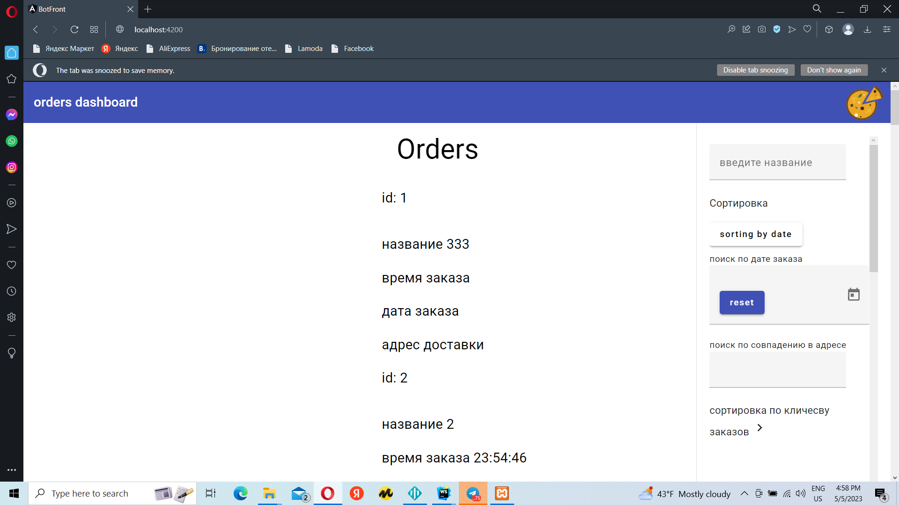
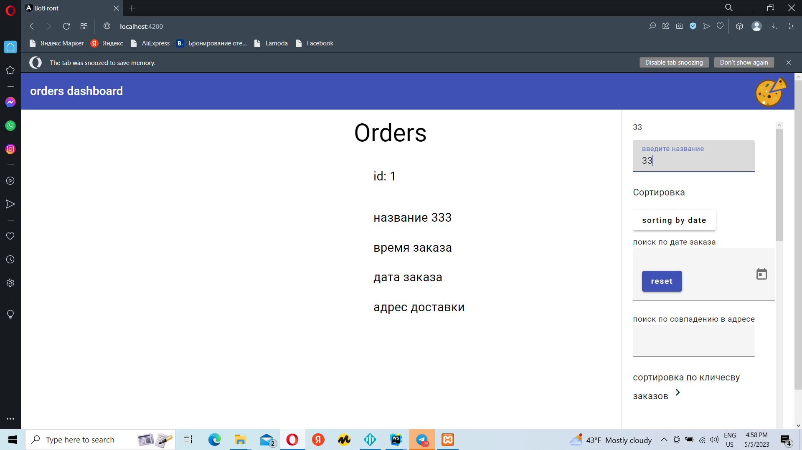
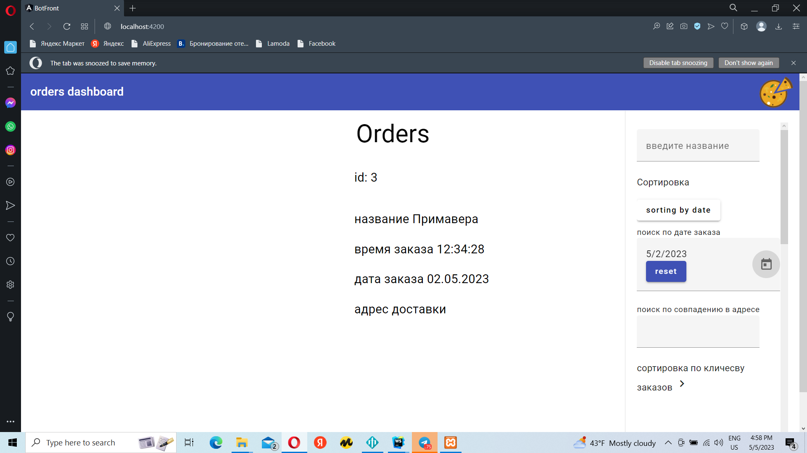
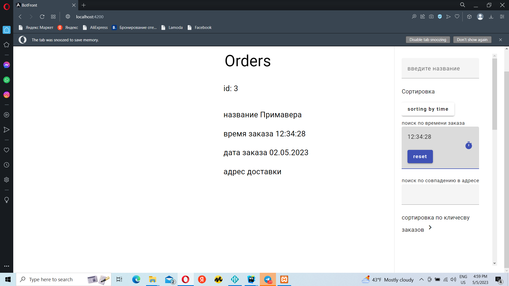
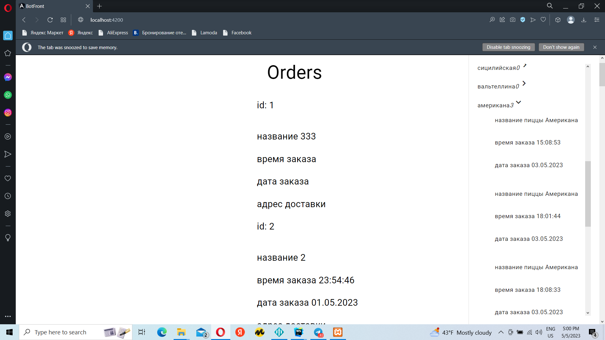

# BotFront - very simple analytics front end for pizza bot
This is deadly simple web page  


```bash
# clone this project to your machine
$ git clone https://github.com/0xc0000007b/bot-front
# change directory tobot-front
$ cd bot-front
#open that project in core editor tool
#i will using the webstorm
#pick  win + r keys and write cmd, 
#and down enter to open command line on windows
$ webstorm .
#to open thats project in webstorm 
# and run 
$ npm install
# or 
$ yarn install
# for install all packages which need in those projects
# and  finally run those command to run webpack 
$ ng serve
 
#dev server on 
```


developement serve will be running on
````http://localhost:4200````
# Functions

1. simple sorting by name of pizza
2. simple sorting by date of order
3. simple sorting by time of order
4. sorting by address of order
5. sorting by count of one type pizzas


## Libraries which i will use
1. Angular material - official open source Angular components library
2. angular-datetime-picker - custom time picker component for app


# Overview
<details>
  <summary>screens</summary>
  
  
  
  
  
  
</details>
